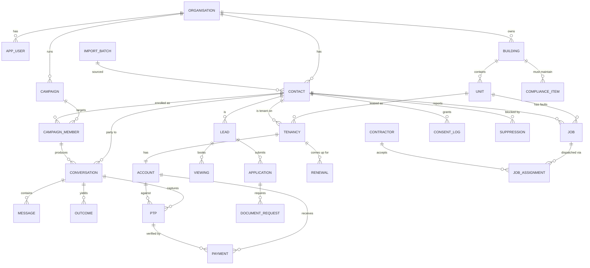

# AIployee Platform — Data Model Specification

**Purpose:** the database behind the Phase 3 dashboard. This is the artefact that
turns AIployee from a service into a product: every call, message, promise, lead
and job lands in one schema, and the dashboard is a read over it.

**Target:** PostgreSQL (Supabase is the natural fit — the Speed to Lead app is
already on Vercel, and Supabase gives row-level security and auth without extra
work).

DDL lives in [`../db/schema.sql`](../db/schema.sql).

**Status:** the DDL has been applied against PostgreSQL 16 — 38 tables, 72 foreign
keys, 87 indexes, 3 materialised views, all clean. [`../db/smoke_test.sql`](../db/smoke_test.sql)
inserts a worked example per department, asserts the four integrity rules that
matter (contact dedup, E.164 format, webhook idempotency, document-request
parentage) and prints the headline metrics, then rolls back. To run both:

```bash
createdb aiployee_dev
psql -v ON_ERROR_STOP=1 -d aiployee_dev -f db/schema.sql -f db/smoke_test.sql
```

The RLS policy at the end of `schema.sql` calls `auth.uid()`, which Supabase
provides. On plain PostgreSQL, stub it first:

```sql
create schema if not exists auth;
create function auth.uid() returns uuid language sql stable as $$ select null::uuid $$;
```

---

## 1. Six design decisions that matter

Everything else follows from these. Get them wrong and the schema fights you
later.

### 1.1 A conversation is channel-agnostic

There is **one `conversation` table** covering outbound voice, inbound voice,
WhatsApp, SMS and email. Not one table per channel.

This is the most important decision in the schema. A real collections journey
looks like: WhatsApp reminder → unanswered call → WhatsApp fallback → inbound
callback → PTP agreed. If voice and WhatsApp live in separate tables, that is
five disconnected records and you can never answer "how many touches did it take
to recover this account?" With one table it is one query.

### 1.2 Contacts are deduplicated on E.164 phone number, globally

One human being can simultaneously be an arrears account (collections), a
renewal target (leasing) and the person who reported a broken geyser
(operations). If each department keeps its own contact list, that person gets
three calls in one morning from three different agents.

`contact` is unique on `(organisation_id, phone_e164)`. Every department
references the same row.

### 1.3 Contact frequency is capped centrally, at dispatch time

Following from 1.2: a `suppression` table plus a hard frequency rule is checked
**immediately before every dispatch**, not when the campaign list is built. A
list built on Monday and dialled on Wednesday is already stale — the tenant may
have paid, complained, opted out, or been handed to attorneys in between.

Suppression reasons: opted out, handed to legal, account disputed, deceased,
contacted too recently, manual hold.

### 1.4 Money is verified, never self-reported

A `ptp` row is a claim. A `payment` row is a fact. `ptp.status` moves to `kept`
only when matched against payment data — never because the agent or the tenant
said so. This is what makes "PTP kept %" defensible when a client challenges it.

### 1.5 Outcomes are normalised, and separate from transcripts

`conversation` holds the raw material (recording, transcript, duration, cost).
`outcome` holds the structured interpretation (reached / no answer / refused /
promised to pay / disputed / callback requested, plus sentiment and summary),
with a `source` field recording whether it came from the call analyser, the
voice platform, or a human review.

Two reasons to split them: the analyser will be re-run as it improves, and the
same conversation can legitimately carry more than one outcome (reached the
tenant *and* took a maintenance report).

### 1.6 Imports keep their lineage

`import_batch` records the source file, the detected format (the existing
Mafadi A–G column layouts), row counts in and out, and rejects with reasons.
When someone asks "where did this phone number come from and why did we call
this person", the answer must be one query, not a search through old
spreadsheets.

---

## 2. Entity overview



---

## 3. Tables by layer

### Layer 1 — Tenancy and access

| Table | Purpose | Key columns |
| --- | --- | --- |
| `organisation` | The client. Mafadi, Ripple Finance, future clients. Hard tenant boundary — every table below carries `organisation_id` and row-level security enforces it. | `name`, `slug`, `timezone`, `active` |
| `app_user` | Logins. Both AIployee staff and client-side managers. | `email`, `full_name`, `is_internal` |
| `org_membership` | User's access to an organisation, scoped by role and department. A Mafadi collections manager sees collections only. | `role` (owner/admin/manager/viewer), `departments[]` |

### Layer 2 — Property and people

| Table | Purpose | Key columns |
| --- | --- | --- |
| `building` | Property. Maps to the "Prop" and building-name columns in the current import files. | `code`, `name`, `address`, `region`, `portfolio` |
| `unit` | Lettable unit. | `unit_number`, `door_no`, `unit_type`, `bedrooms`, `market_rent`, `status` (occupied/vacant/on_notice) |
| `contact` | A person. Deduplicated on `phone_e164` per organisation. | `full_name`, `phone_e164`, `phone_alt`, `email`, `preferred_language`, `whatsapp_opt_in`, `do_not_contact` |
| `tenancy` | A lease: who occupies what, from when to when. Drives both renewals and collections. | `unit_id`, `primary_contact_id`, `start_date`, `end_date`, `monthly_rent`, `deposit_held`, `status` |
| `account` | The financial position of a tenancy. Refreshed from the age analysis. | `balance_total`, `current`, `days_30/60/90/120_plus`, `last_payment_date`, `last_payment_amount`, `as_at` |
| `payment` | Actual receipts. The source of truth for PTP verification. | `account_id`, `amount`, `paid_on`, `reference`, `source` |

**Note on `account`:** store it as a current snapshot plus an
`account_snapshot` history table. Arrears movement over time is a headline
dashboard metric and it cannot be reconstructed if each import overwrites the
previous position.

### Layer 3 — Engagement (the reusable core)

This layer is department-agnostic. Every department writes here.

| Table | Purpose | Key columns |
| --- | --- | --- |
| `campaign` | A defined outbound push or standing inbound handler. | `department`, `campaign_type`, `agent_ref` (Jobix agent/flow id), `schedule_cron`, `status`, `script_version` |
| `campaign_member` | One target within a campaign, with its own state machine. | `campaign_id`, `contact_id`, `subject_type`/`subject_id` (account, tenancy, lead or job), `state`, `attempts`, `next_attempt_at` |
| `conversation` | **One row per interaction, any channel.** | `channel` (voice_out/voice_in/whatsapp/sms/email), `direction`, `started_at`, `ended_at`, `duration_seconds`, `external_ref` (Jobix call id), `recording_url`, `transcript`, `cost_cents` |
| `message` | Individual WhatsApp/SMS/email messages inside a conversation. | `body`, `media_url`, `media_type`, `template_id`, `external_ref`, `status` (queued/sent/delivered/read/failed) |
| `outcome` | Structured result of a conversation. | `outcome_code`, `sentiment`, `confidence`, `summary`, `source` (analyser/platform/human), `analyser_version` |
| `follow_up_task` | Anything needing a human. The escalation queue. | `assigned_to`, `due_at`, `priority`, `reason`, `status` |
| `whatsapp_template` | Meta-approved templates. Outbound WhatsApp outside a 24-hour window requires one. | `name`, `meta_template_id`, `category`, `language`, `body`, `approval_status` |

**Campaign types** — the enumeration that ties the proposal to the schema:

```
collections_pre_due        collections_soft_reminder
collections_first_call     collections_ptp_negotiation
collections_ptp_verify     collections_pre_legal
collections_inbound        collections_deposit_refund

leasing_speed_to_lead      leasing_renewal
leasing_doc_chase          leasing_viewing_reminder
leasing_viewing_noshow     leasing_waitlist

ops_inbound_fault          ops_contractor_dispatch
ops_arrival_verify         ops_satisfaction_check
ops_compliance_reminder    ops_meter_reading
```

### Layer 4a — Collections

| Table | Purpose | Key columns |
| --- | --- | --- |
| `ptp` | **The money table.** A promise to pay, and whether it held. | `account_id`, `conversation_id`, `promised_amount`, `promised_date`, `payment_method`, `status` (open/kept/partial/broken/cancelled), `verified_at`, `verified_payment_id`, `amount_received` |
| `arrangement` | Multi-instalment plans, where a single PTP is not enough. | `account_id`, `instalment_amount`, `instalment_count`, `frequency`, `first_due`, `status` |
| `dispute` | Tenant disputes the balance — must suppress collections contact until resolved. | `account_id`, `raised_on`, `reason`, `status`, `resolved_on` |

### Layer 4b — Leasing

| Table | Purpose | Key columns |
| --- | --- | --- |
| `lead` | An enquiry. | `source` (property24/private_property/website/walk_in/whatsapp/referral), `unit_interest_id`, `budget_max`, `move_in_date`, `bedrooms_wanted`, `status`, `received_at`, **`first_contact_at`**, `assigned_to` |
| `viewing` | A booked viewing. | `lead_id`, `unit_id`, `scheduled_at`, `attended`, `outcome` |
| `application` | A rental application. | `lead_id`, `unit_id`, `status`, `credit_check_status`, `affordability_verified`, `decision`, `decided_on` |
| `document_request` | One required document, and whether it has arrived. Drives the WhatsApp chase. | `application_id` or `tenancy_id`, `doc_type`, `status` (requested/received/rejected), `requested_at`, `received_at`, `media_url`, `chase_count` |
| `renewal` | A lease coming up for expiry. | `tenancy_id`, `expiry_date`, `offer_rent`, `escalation_pct`, `status` (not_started/contacted/negotiating/accepted/declined/vacating), `decided_on` |

**`lead.first_contact_at` minus `lead.received_at` is the speed-to-lead metric.**
It is the single number that justifies the leasing engagement, so it gets a
dedicated column rather than being derived from the earliest conversation.

**Document types:** `fica_id`, `payslip_1`, `payslip_2`, `payslip_3`,
`bank_statement`, `proof_of_address`, `employment_letter`, `prev_landlord_ref`.

### Layer 4c — Operations

| Table | Purpose | Key columns |
| --- | --- | --- |
| `job` | A maintenance job. | `unit_id`, `reported_by_contact_id`, `category`, `priority` (emergency/urgent/routine), `description`, `status`, `logged_at`, `sla_due_at`, `closed_at` |
| `job_media` | Photographs, usually arriving via WhatsApp. | `job_id`, `media_url`, `media_type`, `source_message_id` |
| `contractor` | Service providers. | `name`, `trades[]`, `phone_e164`, `email`, `rating`, `active` |
| `job_assignment` | Dispatch and its lifecycle. | `job_id`, `contractor_id`, `dispatched_at`, `accepted_at`, `scheduled_for`, `arrived_at`, `completed_at`, `cost` |
| `job_verification` | Result of the "did they arrive / is it fixed" calls. | `job_id`, `conversation_id`, `contractor_arrived`, `issue_resolved`, `satisfaction_score` |
| `compliance_item` | Recurring statutory and preventative obligations. | `building_id`, `item_type`, `last_completed`, `next_due`, `responsible_contractor_id` |

**Job categories:** `plumbing`, `electrical`, `geyser`, `roof_leak`,
`appliance`, `locks_keys`, `common_area`, `pest`, `gate_intercom`, `other`.

### Layer 5 — Plumbing and compliance

| Table | Purpose | Key columns |
| --- | --- | --- |
| `import_batch` | Lineage for every uploaded file. | `filename`, `detected_format` (A–G), `rows_in`, `rows_clean`, `rows_rejected`, `uploaded_by`, `created_at` |
| `import_reject` | Why a row was dropped. Usually an unusable phone number. | `import_batch_id`, `row_number`, `reason`, `raw_data` (jsonb) |
| `integration_sync` | State per external system, so syncs are resumable. | `system` (mda/payprop/mri/weconnectu/portal), `entity`, `last_synced_at`, `cursor`, `last_error` |
| `consent_log` | **POPIA requirement.** Append-only record of every opt-in and opt-out. | `contact_id`, `channel`, `action`, `basis`, `source`, `occurred_at` |
| `suppression` | Active blocks on contacting someone. Checked at dispatch. | `contact_id`, `reason`, `department`, `active_from`, `active_until` |
| `webhook_event` | Raw inbound payloads from Jobix and Meta, with an idempotency key. Webhooks arrive twice; this makes replay safe. | `source`, `event_type`, `idempotency_key`, `payload` (jsonb), `processed_at` |
| `audit_log` | Who changed what. | `actor_user_id`, `entity_type`, `entity_id`, `action`, `before`, `after` |

---

## 4. Dashboard metrics and where they come from

Build these as materialised views refreshed on a schedule, not as live
aggregates over `conversation` — that table grows fastest and the dashboard
should stay quick.

### Collections

| Metric | Derivation |
| --- | --- |
| Book value | `sum(account.balance_total)` where in campaign scope |
| Contactability | distinct contacts with a usable `phone_e164` ÷ total in list |
| Contact rate | conversations with `outcome_code = 'reached'` ÷ attempts |
| PTP rate | PTPs created ÷ conversations reached |
| **PTP kept %** | `ptp` where `status = 'kept'` ÷ PTPs with `promised_date` now past |
| Rand promised | `sum(ptp.promised_amount)` |
| Rand recovered | `sum(payment.amount)` matched to a PTP |
| Cost per rand recovered | `sum(conversation.cost_cents)` ÷ rand recovered |

### Leasing

| Metric | Derivation |
| --- | --- |
| Leads by source | count of `lead` grouped by `source` |
| **Median time to first contact** | median of `lead.first_contact_at - lead.received_at` |
| Viewings booked / attended | count of `viewing`, and where `attended = true` |
| Application completion rate | applications with all `document_request` received ÷ all applications |
| Documents outstanding | `document_request` where `status = 'requested'`, bucketed by age |
| Renewal rate | `renewal` where `status = 'accepted'` ÷ renewals decided |
| Days vacant | for each `unit`, days at `status = 'vacant'` |

### Operations

| Metric | Derivation |
| --- | --- |
| Open jobs by age | `job` where `status` not closed, bucketed 0–1 / 2–3 / 4–7 / 8+ days |
| Emergencies outstanding | open jobs where `priority = 'emergency'` |
| Contractor SLA | assignments where `arrived_at <= job.sla_due_at` ÷ all assignments |
| Mean time to resolution | `job.closed_at - job.logged_at` |
| Repeat faults | units with more than one `job` of the same `category` in 90 days |
| Verified arrival rate | `job_verification` where `contractor_arrived = true` ÷ verifications |

---

## 5. Build sequence

The schema is large; it does not get built at once. Each stage is independently
useful.

| Stage | Tables | Unlocks |
| --- | --- | --- |
| **1** | `organisation`, `app_user`, `org_membership`, `contact`, `building`, `unit`, `import_batch`, `import_reject` | Import pipeline writes to a database instead of a spreadsheet. Contact deduplication starts working immediately. |
| **2** | `campaign`, `campaign_member`, `conversation`, `outcome` | Every call has a permanent home. The call analyser writes `outcome` rows instead of a document. First real dashboard. |
| **3** | `tenancy`, `account`, `account_snapshot`, `payment`, `ptp` | PTP verification becomes possible. This is the highest-value stage — it produces the PTP kept number. |
| **4** | `consent_log`, `suppression`, `whatsapp_template`, `message` | WhatsApp goes live, with POPIA-compliant consent tracking and central frequency capping. |
| **5** | `lead`, `viewing`, `application`, `document_request`, `renewal` | Leasing dashboard. |
| **6** | `job`, `job_media`, `contractor`, `job_assignment`, `job_verification`, `compliance_item` | Operations dashboard. |
| **7** | `integration_sync`, `audit_log`, materialised metric views | Direct integration with Mafadi's property system; manual exports stop. |

Stages 1–3 are the platform. Everything after is breadth.

---

## 6. Things to get right early because they are painful to retrofit

- **`organisation_id` on every table, with row-level security from day one.**
  Retrofitting multi-tenancy after Ripple and Mafadi data are mixed is a
  migration nobody wants.
- **Store phone numbers only in E.164.** The existing import cleaning already
  does this. Never let a raw local-format number into `contact.phone_e164`.
- **All timestamps `timestamptz`, stored UTC, displayed in
  `organisation.timezone`.** South Africa has no daylight saving, which makes it
  tempting to be sloppy here. Don't be — the first non-SA client breaks it.
- **Money as integer cents**, never floats.
- **`conversation` will be the largest table.** Partition by month once it is
  material, and keep transcripts in object storage with a URL in the row rather
  than inline text, once transcripts get long.
- **Soft-delete contacts** (`deleted_at`) rather than hard-deleting, except when
  honouring a POPIA deletion request — which needs a real, documented hard-delete
  path across every table referencing the contact.
- **`external_ref` on `conversation` and `message`, unique per source.** This is
  what makes webhook replay idempotent, and webhooks will be replayed.
